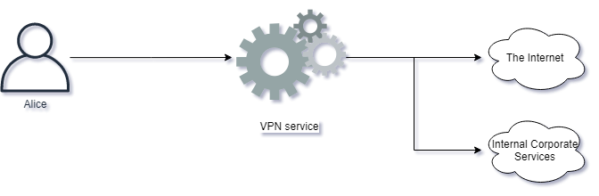

# Cyber Crime

---

## Cyber Crime

- What is Cyber Crime? Just like regular crime, it also exists on the Internet. Here are some examples of Cyber Crime:

  - Identity Theft
  - Online Predators
  - BEC ("Business Email Compromise")
  - Ransomware
  - Stealing of sensitive intellectual property

## Increasing Crime

- Cyber Crime has been increasing regularly every year. Why is Cyber Crime on the rise? Here are some reasons:

  - Cyber Crime is easy to accomplish
  - Low risks of getting caught
  - For little work there is often high returns
  - Attackers can target thousands of victims
  - Money laundering is easier with Cryptocurrencies

- Challenges like identity theft can have significant consequences on an individual, causing not only the potential of financial losses but also a lot of personal grief.

- The Internet offers many services to facilitate money laundering, usually making it a trivial process. As money is exchanged in cryptocurrency, services such as tumblers make it hard to track the money.

- Tumblers are services which split up cryptocurrency transactions and forward the money through many accounts, with different values, for thousands of people, making them hard to track.

## Cyber Criminals

- Who are Cyber Criminals? It can be anyone, but let us discuss some common ones we see in the media all the time:

  - State-sponsored groups targeting organizations in other countries
  - Hacking Groups out to target companies to make them pay ransom
  - Kids in their rooms doing illegal hacking

> **Note:** Cryptocurrency is money represented in digital form instead of physical. There are many different Cryptocurrencies, some very widespread like Bitcoin, and others smaller and unknown to most people. These currency models relies on strong cryptography and public ledger systems to keep track of transactions and how much currency is on the market.

## Catching Cyber Criminals

- Cyber Criminals can stay anonymous with trivial means, and typically easy to avoid getting caught. When attackers do get caught, it is often because of mistakes made by the attackers themselves, for example as a result of becoming complacent. There is also a great deal of potential for law-enforcement to use caught cyber criminals to rat out others in the industry.

- Law enforcement do, however, have many challenges in tracking down cyber-crime. You might see attack traffic coming in from a system residing in UK, and when taking down this system, you realize it was being remotely controlled by e.g. another system in India. Cooperating with law-enforcements across borders, you might be able to get to the system in India, but only to realize it was again remotely controlled through e.g. Pakistan.

