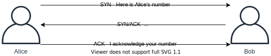

# Network Transport

---

## In-Depth Transport and Link Layers

- Computer systems often needs to talk to other systems; this is done by putting them on the same network. Several different technologies are in place to enable computers to talk over different kinds of networks. In this section we will go deeper into the protocols which are used in most networks.

- The networks we are using consists of multiple protocols, some which are featured in this class. There are also many other protocols in use in networks, all which have the potential of having security risks associated with them.

## TCP ("Transmission Control Protocol")

- Just like IP uses IP addresses for addressing, TCP and UDP uses ports. A port, as indicated with a number between 0 and 65535, dictates which network service should process the request.

- In the picture below we can see a TCP packet and how it would look like for anyone inspecting traffic on the network.


- We can see the graphic showing 16 bits for both source and destination ports, this is the same for for UDP. The Sequence and Acknowledgement numbers are used in the three-way handshake and to reliably transfer data. We can also see the control bits used to indicate what kind of packet it is. The other headers also play an important part, but outside of the security course.

## TCP 3-Way-Handshake

- TCP uses a three-way handshake to allow two systems to engage in communications. The handshake uses 32 bits of PRNG ("Pseudo Random Number Generator") numbers to establish the handshake. The handshake enforces that both parties intends to communicate.

- Here is a graphic to illustrate:



- Explanation on how TCP engages in communications:

  - 1\. Client initiates the communication by sending a packet with the control bit SYN set in the header, a PRNG number in the Sequence number field and a target destination port. The Network Layer (Layer 3) allows the packet to be sent to a remote system. This packet is referred to as a SYN packet.
  - 2\. Server receives the packet, reads the Sequence Number from the Client and crafts a response. The response sets the Acknowledgement field with the Sequencer number of the client with the number 1 added to it. Furthermore the response contains the controls bits SYN and ACK set and the Sequence number is set to the Servers PRNG number. This packet is referred to as a SYN/ACK packet.
  - 3\. The Client receives the SYN-ACK packet and to complete the handshake returns a packet with the ACK control bit set. The final packet also confirms the PRNG number from the Server by returning it in the Acknowledgement field of the header.

- This process is commonly referred to as the SYN, SYN/ACK, ACK 3-way handshake.

- In the following picture we can see two hosts performing the 3-way handshake:


- The screenshot shows the tool Wireshark being used to capture and inspect packets. Wireshark is a very good utility because it allows us to visualize packets and inspect them more in-depth. The screenshot shows 3 packets representing the 3-way handshake. Notice the source and destination columns representing the two parties communicating. The Info field shows source and destination port, including (within the square brackets) the SYN, SYN/ACK and ACK.

- The next screenshot shows data being communicated between the parties after the 3-way handshake. The data inside of the TCP packet has been highlighted near the bottom of the picture.


> **Note:** A message to W3School students is shown in the screenshot above. Can you see it?

## Spoofing Traffic

- There are few restrictions on networks today for anyone to create packets as they desire. Anyone can create packets with any of the fields of the headers set to whatever value they desire. This is called spoofing, allowing attackers to send traffic on behalf of others.


- TCP has security built into the protocol, but it relies on the strength of the PRNG ("Pseudo Random Number Generator") number generators. If the Sequence numbers of the communicating parties can be guessed, the security of TCP can be compromised in the sense that an attacker can engage in spoofed communications via TCP.

- Many protocols are easily spoofed, but TCP offers some resiliency against this. Protocols such as UDP and ICMP does not offer similar protection.

- Spoofing packets is typically done by attackers with root / system capabilities, i.e. the highest privileges on the Operating System. The reason being that Operating Systems enforces the use of API's which forces the user to conform to the rules of communications as specified in RFC's ("Request For Comments"). If the attacker does not have the highest privileges, they will not be able to craft their own packets on the network.

## UDP ("User Datagram Protocol")

- UDP is used for traffic which does not need the resilience and security of TCP, typically applications such as VOIP, but in the modern world more applications are using UDP to support fast packet transfer with resiliency and security built into the higher levels of the OSI model; QUIC is an example of this.

- Looking at the UDP Header we can see the same Source and Destination ports in use, but no Sequence numbers or Control bits. The protocol has much less overhead, leading to faster transmission of data.


- Because UDP does not have features such as the 3-Way-Handshake, UDP can be easily spoofed.

## Switched Networks

- Systems are connected to a LAN ("Local Area Network") through a Switch. Switches uses MAC ("Media Access Control") addresses for addressing, not the more well-known IP address. Switches forward traffic across Local Area Networks, i.e. your home-network or within branches of your organization. MAC Addresses are designed to be unique, but anyone can change their MAC Address as long as they have administrator rights.

- The MAC address defined by 6 octets, for example: FC:F8:AE:12:34:56

- The first three octets represent the organization which manufactured the device communicating, called OUI ("Organizational Unique Identifier"). The above MAC address is assigned to Intel Corporate. You can search for MAC Addresses in many places, for example: https://www.adminsub.net/mac-address-finder/intel.

- The last three octets is determined by the manufacturer.

## ARP

- ARP ("Address Resolution Protocol") is the protocol which allows computer systems to know which MAC address belongs to which IP address. If the traffic has to be routed, the computer system will forward traffic to the Default Gateway configured on the system.

- ARP, like DNS, is a protocol which resolves one address into another. Every time a system tries to communicate to an IP address which is on the LAN it will check its ARP cache to see if has recently been resolved.

- You can inspect your own ARP. Simply run the command arp -a on both Linux or Windows. This reveals which systems your system has recently communicated with.

```sh
Alice: Does anyone know the MAC address of 192.168.10.10?
Bob: Sure thing Alice, here is my MAC Address.
```

## VLAN ("Virtual LAN")

- VLAN, often called Private VLAN's, is a way for a Switch to embed tags (or a VLAN ID) within the Frame. Multiple Switches can then make sure that computer systems on the LAN can only communicate to certain other systems, i.e. other systems on with the same VLAN ID.
