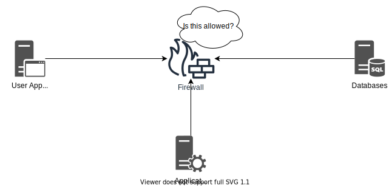

# Firewalls

---

## Firewalls

- Firewalls are a central architectural element to any network. They are designed to keep out all network traffic, except traffic which we allow. Firewalls operate on Layer 4, typically controlling TCP and UDP access to internal assets. Next-Generation Firewalls operate on all the layers of the OSI model, including Layer 7.

- Traffic entering a network, e.g. through a Firewall, is called ingress traffic. Traffic leaving is called egress.

## Layer 4 Firewall

- The traditional Firewall is a Layer 4 Firewall with features such as:

  - NAT
  - Routing
  - Blocking or Allowing traffic
  - Track active network connections
  - Support VPN connections

  > **Note:** These Firewalls are typically cheaper and offers more throughput on the network than a more modern Next-Generation Firewall.

## NGFW ("Next-Generation Firewalls")

- A modern Firewall has capabilities that range much wider than a a Layer 4 Firewall. These capabilities are typically security features.

- A NGFW Firewall can also track active network connections, but is also typically capable of tracking:

  - Locations via geo-location databases. This means the Firewall can make blocking or allow actions based on the location of users. Location services are not always accurate and - can often easily be bypassed using VPN services or by using other services like jump stations for attacks.
  - Users
  - Applications
  - Sessions
  - Ports and services
  - IP addresses

- Other features of a NGFW includes:

  - Identify and control applications on the network.
  - It can be virtualized to run as a software Firewall.
  - Often offers simple and intuitive management.
  - Supports protecting against known threats via ("Intrusion Prevention System").
  - Potential to detect and prevent unknown threats via sandboxing solutions.
  - Offers a potential to manage unknown traffic, e.g. traffic which cannot be attributed to an application.
  - Capabilities to terminate and inspect encrypted traffic.
  - Can control users, not just system via respective IP addresses.

    

> **Note:** Which features your NGFW comes with often greatly depends on which licenses have been purchased and the capacity of the hardware running the Firewall.

## Firewall Administration

- A Firewall can typically be administered via a proprietary management application, or via a web-browser accessing the Firewalls management via HTTP.
- Management ports to Firewalls, including other management services of an organization, should ideally be segmented away from regular user access. Ideally the segmentation of management services is connected to an organizations user directory, for example Active Directory for Windows environments.

## Segmentation

- Firewalls can segment traffic between hosts and systems into segments, sometimes called zones. Each segment holds services which are allowed to communicate between one another.

  

- Any connection to or from the segment should be carefully controlled by the Firewall, preventing any unauthorized connections to make successful connections. Smaller segments offer more segregation, but requires more management.

- Without any segmentation, users and systems can talk directly to each other without the Firewalls enforcement. This is called a flat network.

  

- Adding more segmentation we can envision segments representing services, where each segment is a service provided in the organization. Each segment could contain the different servers responsible for making the service operational. Communications within the segment is allowed, but any access in and out from the segment is controlled by the Firewall.

- Another segmentation idea would be to control segments based on their functions, for example clustering web applications within a segment with other web-applications, databases within one segment and other kinds of services within their segment.

> **Note:** A very common user directory is Microsoft's Windows Active Directory. It holds information about which users, computers and groupings the organization holds.

- The best and most secure kind of segmentation is called zero-trust architecture, forcing all systems on the network to explicitly be allowed to communicate to different services.

- To ease management of Firewall rules, the Firewall management is ideally connected to the organizations user directory. This can allow Firewall administrators to create careful rules based on employee responsibilities, allowing the organization to add and remove permissions which are applied on the network without asking the Firewall administrators for changes anytime there is a role change. This is sometimes called user-based policy control. Examples include:

  - IT-Administrators should be able to use management protocols to the different services.
  - HR employees should be allowed to access HTTPS to the HR platforms.
  - Helpdesk employees can only access helpdesk related services.
  - Unrecognizable users can be identified and provisioned accordingly.

> **Note:** A very common user directory is Microsoft's Windows Active Directory. It holds information about which users, computers and groupings the organization holds.
